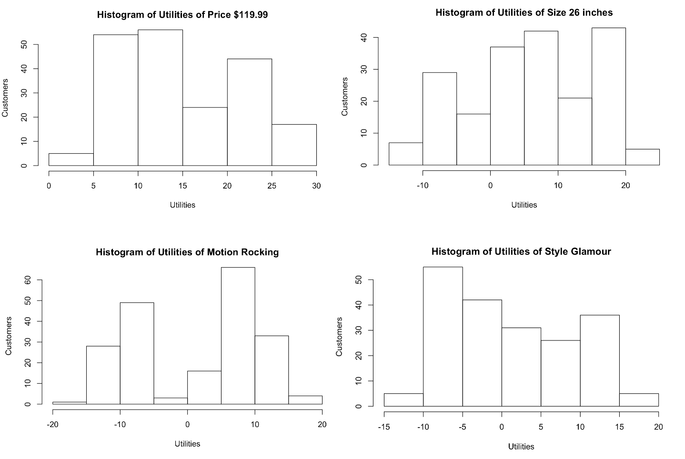

# EarlyRiders-Toy-Horse-Conjoint-Analysis

EarlyRiders is a small toy company that specializes in the manufacture of quality toy riding horses with a particular focus on natural materials. This company had a recent management change and realized that their product set was underperforming. They currently offer two products and one in particular was not doing well. The management team decided after much deliberation to revitalize their product portfolio based on the opinions of potential end-users. For this purpose, a conjoint analysis was run by the company, and the goal was to analyze the conjoint data and provide product line adjustment recommendations to the management team.

EarlyRiders commissioned a conjoint study of parents of 2-4 year old kids who planned to purchase a toy horse. In the study, each parent had only one child in the desired age range. Each kid-parent pair was brought into a play location and given the opportunity to ride different prototype horses. The demographic information of each kid is listed as below.

After the kids played on the different horses for 30 minutes, the parents were asked to complete a short conjoint ratings study conducted via paper and pencil. Each parent rated a total of 12 profiles. Those profiles vary in four attributes: price, height, motion, and style. The levels for retail price are $119.99 and $139.99, for height are 18" and 26", for motion are rocking or bouncing, and for style are glamorous or racing. 

They were told to get their children's input as if they were going to make this purchase for their child. Because I only had each parent’s ratings for 12 profiles, so I predicted their ratings for the missing profiles using the individual part utilities calculated by linear regression based on the existing ratings.

The distribution of the customers’ utilities for different attributes are shown in the figures. 

